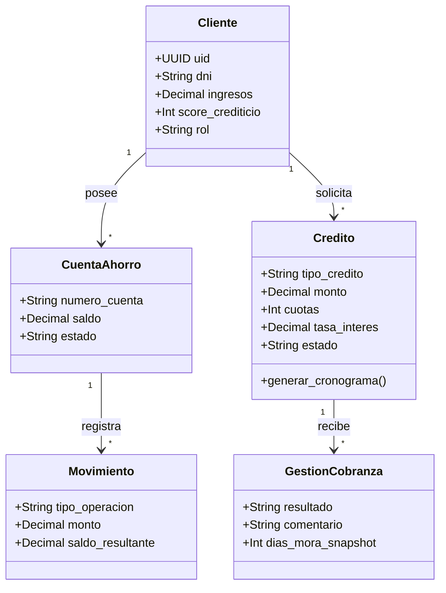

# Financiera Confianza - Plataforma Bancaria

Este proyecto es una aplicación web bancaria (Core Bancario) desarrollada para simular las operaciones de "Financiera Confianza". Su objetivo es proporcionar a los clientes una plataforma segura, moderna y fluida para gestionar sus finanzas.

## 🚀 Propósito del Proyecto

El objetivo principal es brindar una interfaz de usuario **Premium** y una arquitectura robusta en el backend para manejar la autenticación de usuarios, visualización de productos financieros y ejecución de transacciones. 

Sirve como un portal digital donde un cliente puede:
- Registrarse e Iniciar Sesión de forma segura usando su número de documento (DNI, RUC, Carnet de Extranjería).
- Ver el resumen general de sus finanzas (Dashboard).
- Revisar detalles de productos específicos: Ahorros, Créditos, Seguros.
- Simular u operar servicios financieros y transferencias.

## 🛠️ Stack Tecnológico

- **Backend:** [Django](https://www.djangoproject.com/) (Framework de Python)
- **Frontend:** HTML5, **Vanilla CSS** (con un enfoque en UI/UX moderna, colores corporativos bancarios y micro-animaciones).
- **Base de Datos:** SQLite (para desarrollo local) / Configurado para PostgreSQL en producción.

## 📂 Estructura del Proyecto

El proyecto está dividido en múltiples aplicaciones (Apps) de Django, separando la lógica de negocio según el producto bancario:

* `authentication/` - Maneja el inicio de sesión, registro de clientes, modelos de usuario y seguridad.
* `dashboard/` - Renderiza la interfaz principal (Premium UI) donde el cliente ve su resumen financiero, saldo y últimos movimientos.
* `ahorros/` - Módulo para la gestión de cuentas de ahorro.
* `creditos/` - Módulo para el manejo de préstamos, tasas y deudas.
* `seguros/` - Módulo para afiliación y consulta de pólizas de seguro.
* `servicios/` - Módulo para el pago de servicios básicos.
* `transferencias/` - Lógica para enviar y recibir dinero entre cuentas.
* `core_bancario/` - Módulo base para procesos internos.

## 🎨 Diseño y UI/UX

Se ha puesto un fuerte énfasis en la estética, asegurando que la aplicación no se vea básica. 
- Se utiliza un esquema de colores confiable (Azules marinos) con contrastes modernos.
- El diseño es responsivo y limpio, implementando tarjetas flotantes, sombras suaves y transiciones fluidas.
- Las vistas principales incluyen íconos de *Bootstrap Icons* y fuentes modernas (*Google Fonts: Inter / Nunito*).

## ⚙️ Cómo ejecutar el proyecto en modo Desarrollo

1. **Activar el entorno virtual:**
   En Windows (PowerShell), asegúrate de estar en la raíz del proyecto y ejecuta:
   ```bash
   .venv\Scripts\Activate.ps1
   # o bien
   venv\Scripts\Activate.ps1
   ```

2. **Aplicar migraciones (Si hay cambios en la Base de Datos):**
   ```bash
   python manage.py makemigrations
   python manage.py migrate
   ```

   ```bash
   python manage.py runserver
   ```
   Luego, abre tu navegador y dirígete a [http://127.0.0.1:8000/](http://127.0.0.1:8000/).

## 📊 Historias de Usuario

- **HU01 - Login Seguro:** Como cliente, quiero iniciar sesión con mi DNI y contraseña de forma segura (JWT) para ver el resumen de mis productos.
- **HU02 - Solicitud de Crédito:** Como cliente con score > 400, quiero solicitar un crédito ingresando el monto y plazo para obtener financiamiento.
- **HU03 - Cronograma de Pagos:** Como cliente, quiero ver el cronograma de mi crédito activo (Capital, Interés, Saldo) para planificar mis pagos.
- **HU04 - Evaluación de Riesgos:** Como analista de riesgos, quiero ver las solicitudes pendientes y el RDS del cliente para aprobar o rechazar con base en la capacidad de pago.
- **HU05 - Gestión de Mora:** Como gerente, quiero ver la cartera morosa agrupada por bandas (Preventiva, Temprana, Tardía, Judicial, Castigo) y registrar gestiones para recuperar los activos.

## 🏗️ Diagrama de Clases / Arquitectura de Datos


